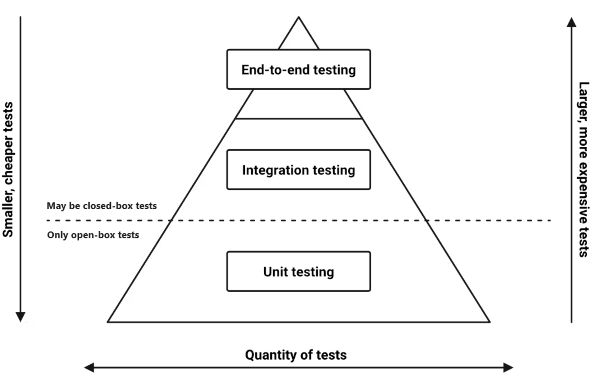

# Mindful Testing
**Or: How I Learned to Stop Worrying and Love the ~~Bomb~~ Process of Creating Comprehensive Test Suites to Do All the Worrying For Me**

## Why Test?

Testing is a nontrivial and challenging intellectual endeavor, so the top priority must be to satisfy the existential question: **Why should we spend the time and effort on it?** 

#### Product Benefits
The first-order goal of software testing is to answer two specific questions before shipping a product or feature. These questions are **fundamental** to verifiable software quality, and thus essential to building the organizational trust that attracts and retains users:
- *Have we built the correct software?* (i.e. does it satisfy the product/user requirements)
- *Have we built the software correctly?* (i.e. is it free of bugs/defects)

#### Product Benefits
That trust alone is enough to make testing worthwhile, but the second order-benefits of well-tested software can be even more valuable as they compound over time: **A solid test suite gives you the confidence to make changes quickly**, relying on the safety net of your test coverage to alert you about any unintended consequences to existing functionality. The sweet spot of testing effort is for the speed imparted by this confidence to (eventually) outweigh the effort spent writing and maintaining tests.

#### Communication
Testing also provides information—to the author of the code, to code reviewers, to future maintainers, and to product stakeholders. Tests can serve as documentation of both high level product specification and internal systemic component expectations. A list of well-constructed test case descriptions can ideally be read over by nontechnical product stakeholders and verified for behavioral correctness, e.g.:

- **`User Account Status`**
    - `Returns PENDING for unverified User`
    - `Returns ACTIVE for verified User with active Account license`
    - `Returns EXPIRED for verified User with expired Account license`
    - `Returns ACTIVE for verified User before trial expiration date`
    - `Returns ACTIVE for verified User on trial expiration date`
    - `Returns EXPIRED for verified User after trial expiration date`

#### Code Clarity
Finally, testing is an opportunity to reveal issues with code quality. For instance, code that requires too many tests could probably use stronger constraints (i.e. stronger input typing), or scope refactoring (into subcomponents that can be tested individually as M tests + N tests, instead of MxN tests). As a rule, *test smells usually signify code smells.*

The reason for this is simple. Code that is hard to test is also frequently hard to understand, because human code readers tend to think like tests, e.g. *"Okay, so this function does X if Y, but Z if not, and throws an error if W is missing…"* Testable code strongly correlates to readable code, so testing should be done (or at least planned) early, and code should be written with testing in mind.

## What To Test?

The answer to this question is more of an Art than a Science. Most attempts to make it a science miss in one direction or another. For instance, code coverage metrics are at-best naive, and at-worst dangerous. Pursued as a goal in and of itself, coverage minimums tend to actively make things worse by encouraging useless, tedious tests—written rotely and without thoughtfulness—and by imparting a false sense of security.

Pragmatically, exhaustive testing is not an achievable (or desirable) goal. Testing effort should be focused on high risk, critical logic. Testing shows the *presence* of defects, not the *absence*, so treat this question as an opportunity to assess risk, and focus your coverage to where the presence of defects would be most costly.

One thing to keep in mind is the principle of **Defect Clustering**: bugs are not evenly distributed in any given codebase, but instead tend to cluster in a few specific areas. Every bug can be expressed as a missing test case—and in fact, defect clustering suggests that every bug might be a sign of multiple missing test cases / future bugs. *Follow your bugs, and listen to them.*

Generally, we can avoid testing trivial/pass-through/plumbing code, and we can treat private functions as implementation details. We want to avoid [change-detection tests](https://testing.googleblog.com/2015/01/testing-on-toilet-change-detector-tests.html), where test failures signify a difference in implementation rather than functionality (Unfortunately, that can be tricky to avoid in unit tests, because the implementation IS the functionality under test). 

Test **cohesive units of logic**, with the qualifier “cohesive” meaning different things for different testing contexts (See Test Pyramid below for elaboration):
- *Unit Tests*:  cover all non-trivial if/switch code paths (especially anything containing business logic), edge cases, errors, particularly for public module interfaces (exported functions, public class methods)
- *Integration Tests*:  cover any critical touch points between system components, e.g. API expectations, data contracts, distributed module communications
- *End-to-End Tests*:  cover critical product/user expectations of the system as a whole

#### A Caveat:

It took me a while to learn this, after comparing my experiences between large companies and several startups, but it's an important point to keep in mind: **testing effort (especially at the unit test level) should be scaled to the stability of the product**. Things that will change significantly and/or frequently are probably not worth testing as comprehensively as things that are likely to be stable across product redefinitions and feature additions. Anything likely to be refactored or significantly modified ends up feeling tedious to maintain when it generates dozens of unhelpful test failures (which, in turn, discourages refactoring and proper maintenance to begin with). 

When in doubt, I generally err on the side of adding tests. It’s easier to delete a redundant or noisy test than it is to add new tests to legacy code in the future.

#### Can You Express This Wisdom As A Shape?

The **Test Pyramid** is a good baseline for structuring the scope and effort of a test suite:
- *Unit Tests*
    - The foundation of a good test suite
    - Smallest, most numerous, and fastest tests in the suite
    - Should never require any system initialization
    - Any dependencies outside of the function/class being tested (external services, database, etc) are usually mocked 
    - Tend to focus on units of component functionality over product specification
- *Integration Tests*
    - More complex, multi-component tests
    - Immediate interdependencies / touch points of business and data layers tested together (e.g. system logic as it pertains to the database, redis, jetstream, etc.)
    - Focus is on data contracts and communication patterns between components
    - Can also test the integration of external APIs to protect against changes
- *End-to-End Tests*
    - Full system tests, all dependencies working together in live environment
    - May be complex and long-running
    - Focused on product/user level behaviors
    - Expensive to write, run and maintain, so coverage is limited to core paths, relying on unit/integration tests to inductively cover the breadth of cases

## How To Test?

First and foremost: **TEST CODE IS CODE!** PR reviewers should pay as much attention to tests as they do to code when reviewing, specifically with an eye towards ensuring the test implementation matches the test description, as well as identifying any missing edge cases. We all make unstated and often-erroneous assumptions when writing a piece of software, and those assumptions carry over into our test strategy—test cases might be missing around "assumed to work" or "assumed impossible" edge cases.

Generally, good tests tend to:
- Cover one and only one expectation at a time
    - Failure then provides specific and granular debugging information to the coder
    - This minimizes overlap with other tests, which cuts down on noise/redundancy 
- Run independent of other tests
    - Self-initializing and self-cleaning
- Express realistic input scenarios
    - And any possible edge cases
- Execute quickly
    - *Including system setup*
    - Fast feedback encourages frequent test running
- Run repeatably and reliably
    - A **flaky** test is an **ignored** test, is a **useless** test
- Be easy to find
    - The *tests* directory should mirror the *src* directory
    - Tests for `XYZ.ts` should be in file `XYZ.spec.ts`
- Follow a simple narrative, without conditional logic:
    - **GIVEN**: *A definition of the inputs and environment*
        - This is where test data is created, required components are spun up, and any mocking behavior is defined
    - **WHEN**: *The test case itself*
        - The test scenario is executed
    - **THEN**: *Assertions and expectations*
        - Outputs and side effects are validated
    - Example:
        - **GIVEN** A verified User with an expired Account license
        - **WHEN** I request the status of that User
        - **THEN** The result should be `EXPIRED`

### In conclusion

*Writing a good suite of tests should feel meditative. Testing is a mindful activity, and an investment in the future—not a formulaic checkbox item. Over time, a mindful tester’s software becomes more in-tune to The Zen of Testing, creating a fluid symbiosis where code is structured and refactored almost intuitively until there is no friction between The Need for Test Coverage and The Ease of Testability in the project.*
